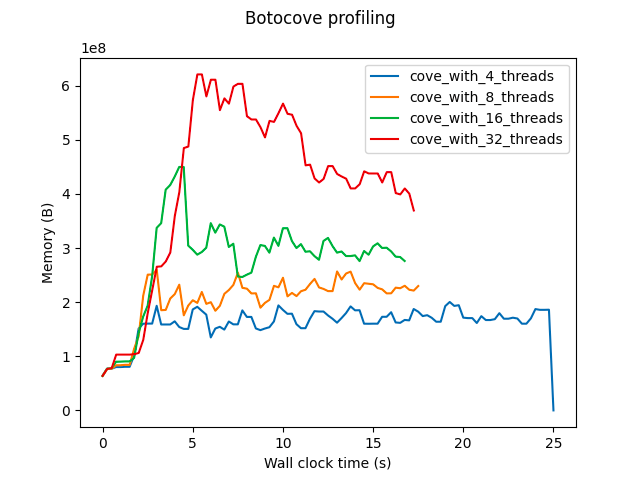

# Botocove profiler

Example output:



You can generate a plot like this:

```bash
poetry run python compare.py --member-account-id 111111111111
```

By default it simulates an organization with 100 member accounts.

## See also

Doesn't appear to have a way to overlay different runs for comparing performance.
https://github.com/pythonprofilers/memory_profiler

Maybe?
It logs and plots the memory usage of all the variables during the execution of the decorated methods.
https://github.com/jmdana/memprof

And see also my old, old branch for the profiling.
